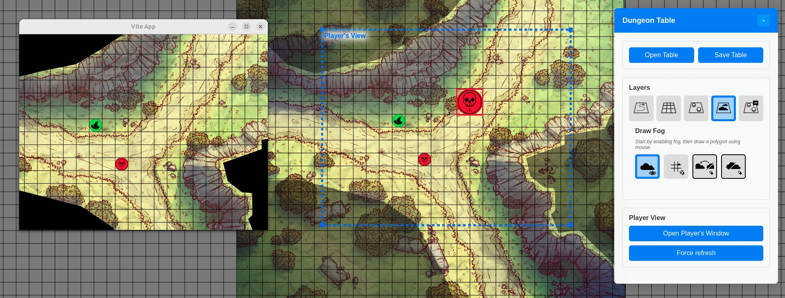

# Dungeon Table – The No-Bullshit Virtual Table Top

**A simple, intuitive Virtual Table Top for local tabletop RPG sessions.**
No bullshit features, no complex setup. Just plug in a screen, launch, and play.



---

## 🏹 Why Dungeon Table?

Dungeon Table is designed and optimized for **in-person tabletop RPG sessions** with a screen/TV on the table and can also be used for online games.
It’s **lightweight, portable, and focused on essential features**—no unnecessary clutter.

### Key Features
- ✅ **Player View Window** – Players see only what the GM allows, with **a resizable window controlled from the GM's window**.

- ✅ **Multi-Layer Image Import** – Easily add maps, tokens, and assets on different layers.

- ✅ **Fog of War Drawing** – Dynamically reveal/hide areas of the map.

- ✅ **No Installation** – Ready-to-use packages for **Windows & Linux** (MACOS soon).

- ✅ **Intuitive UI** – Designed for quick setup and smooth gameplay.

---

## 📦 Download & Run

### Windows
1. [Download the latest Windows package here](https://github.com/TheSoubi/DungeonTable/releases).
2. Run the `.exe` file by double-clicking on it and you're done !

### Linux
1. [Download the latest Linux .AppImage here](https://github.com/TheSoubi/DungeonTable/releases) .
2. Run the `.AppImage` file by double-clicking on it and you're done !

---

## 🎮 Quick Start Guide - Help

1. **Add map and tokens** by selecting a layer (Map, Token, GM) and importing an image on it by clicking the dedicated button.
2. **Draw fog of war** : select the Fog layer and click "Enable Fog". Then you can draw a polygon on the screen using your mouse to remove or add fog.
3. **Open the Player View** (second window) using the "Open Player's Window" button on the interface. You can resize it from the main window (move and zoom).
4. **Save your session** : you can save your session locally and open it later. Dungeon Table's file have a .dtable extension. They are zip archives that you can open with an external software.
5. **Start your session!**

---

## 🐛💬 Bugs & Support

- **Bug**: You can report a bug by creating an issue [by clicking here](https://github.com/TheSoubi/DungeonTable/issues/new).
- **New feature proposal**: You can submit a proposal for a new feature by creating an issue [by clicking here](https://github.com/TheSoubi/DungeonTable/issues/new).

---

## 📜 License
Local VTT is licensed under the **[MIT License](LICENSE)**.
Feel free to use, modify, and share!

---

## 💻 Development Setup

### Install everything

```sh
npm install
```

### Start app in dev mode

```sh
npm run electron:dev
```

### Start app for development

```sh
npm run electron:dev
```

### Build backend and app to electron package

Python's backend server will be packaged to an executable.

```sh
npm run electron:build
```